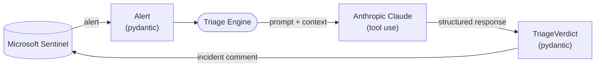

# Sift

> *Sift signal from noise.*

An LLM-augmented triage layer for Microsoft Sentinel alerts.

For each incoming alert, Sift uses a frontier LLM to produce a structured, MITRE ATT&CK-mapped first-pass triage verdict — written back as an incident comment so a human analyst sees it before opening the alert.

---

## Status

🚧 **Active development — Week 1 of ~6.** Currently in pre-alpha. End-to-end pipeline working against synthetic alerts. Real Sentinel integration scheduled for Week 3.

This README will evolve as the project does. Roadmap below.

---

## Why this exists

A modern SOC generates thousands of alerts per day. The cognitive cost of triage — reading the alert, pulling context, mapping it to known techniques, deciding whether it's worth investigating — consumes most of an analyst's working hours. Most of that work is pattern-matching against prior context, and that's exactly what frontier LLMs are good at.

Sift is a thin layer that sits between Microsoft Sentinel and the human analyst. For each incoming alert it produces a **structured triage verdict** containing:

- A revised severity assessment with reasoning
- Confidence level
- Likely MITRE ATT&CK technique mapping
- A recommended next step (escalate, hunt, close, etc.)
- Supporting context the analyst would otherwise gather by hand

Output is written back as an incident comment for human review. **The LLM advises. The analyst decides.**

---

## Architecture



Each alert flows through three contracts: `Alert` (validated input from the Sentinel API), the LLM call (a system prompt plus alert context, structured response via Claude tool use), and `TriageVerdict` (validated output written back to the incident as a comment). Pydantic enforces the boundaries; Claude does the reasoning; the analyst gets the final say.

**Tech stack**

- Python 3.12+
- `anthropic` — Claude API client
- `pydantic` v2 — data models, structured output via tool use
- `httpx` — Microsoft Graph Security API client
- `uv` — project + dependency management
- `pytest` — test suite
- `ruff` — lint + format

---

## Quick start

> Currently runs against synthetic alert fixtures. Sentinel integration lands in Week 3.

```bash
git clone https://github.com/eternalr00ted/sift.git
cd sift
uv sync
cp .env.example .env   # add your ANTHROPIC_API_KEY
uv run python -m sift.cli triage --alert samples/alert_001.json
```

Expected output is a structured `TriageVerdict` printed to stdout.

---

## Roadmap

- ✅ **Week 1 — Vertical slice.** End-to-end pipeline: load synthetic alert, call Claude, print response.
- 🚧 **Week 2 — Structured output.** Pydantic models, tool-use schemas, parsed `TriageVerdict` objects.
- 📍 **Week 3 — Sentinel integration.** Microsoft Graph Security API client, real alert ingestion.
- 📍 **Week 4 — Write-back.** Triage verdicts posted as incident comments for analyst review.
- 📍 **Week 5 — Test suite + CI.** Unit and integration tests, GitHub Actions pipeline.
- 📍 **Week 6 — Polish.** Documentation, sample alerts, README examples, basic observability hooks.

---

## Design philosophy

**LLMs advise; humans decide.** Every triage verdict surfaces to a human analyst. Sift does not auto-close, auto-escalate, or take action without review.

**Auditability over magic.** Every triage call is logged with full input and output context so verdicts can be replayed, reviewed, and improved over time.

**Prompts are code.** System prompts live in version control, are tested, and are revised with the same rigor as detection logic. Sift treats prompt engineering as detection engineering.

**Observable behavior.** Detection engineers expect to introspect what their detections do. The same standard applies here — verdicts include reasoning, not just decisions.

---

## AI-assisted development

Sift is built with Claude as a co-author: boilerplate scaffolding, debugging assistance, code review, and documentation passes. The core triage logic, prompt engineering, MITRE mapping, and architectural decisions are the author's own.

This is the deliberate practice of AI-augmented engineering with clear ownership boundaries — using AI where it accelerates, owning the parts that matter.

---

## License

Apache License 2.0. See [LICENSE](LICENSE).

---

## About

Built by **Khalid Ozal** — SOC analyst and detection engineer focused on Microsoft security and the emerging space of LLM-augmented defense. More writing at [Eternalr00ted](https://eternalr00ted.com).
